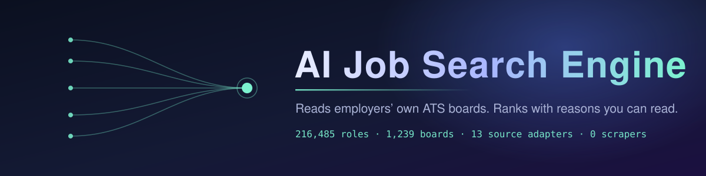

<p align="center">
  
</p>

<p align="center">
  <b>A job search engine that reads employers' own applicant tracking systems — not aggregators, not scrapers.</b><br>
  Natural-language queries become hard filters. Every result explains why it ranked where it did.
</p>

<p align="center">
  
  
  
  
  
</p>
<p align="center">
  
  
  
  
  
  
</p>

<p align="center">
  
  
  
  
</p>

---


## What this is

Most "job search" products are a search box over an aggregator's copy of a job
posting. This one goes to the source: it reads the public, documented, no-auth
JSON feeds that power employers' own careers pages — Workday, Greenhouse, Ashby,
SmartRecruiters, Oracle Recruiting Cloud and eight more — normalises them into
one schema, deduplicates across boards, and ranks with a transparent scorer.

Three things follow from reading the source rather than an aggregator:

- **The jobs are real.** A company with a live ATS board answering on its own
  domain is a real employer really hiring. That is a stronger genuineness signal
  than anything scraped off a listings page.
- **It is permitted.** LinkedIn's and Indeed's terms prohibit scraping. Every
  endpoint used here is the employer's own public feed. Nothing here needs to be
  operated in the dark.
- **The fields survive.** Aggregators strip department, compensation, workplace
  type and requisition ids. Reading the ATS keeps them, which is what makes
  real filtering possible.

## What it does that a job board doesn't

| | |
|---|---|
| **Natural-language search** | `"senior ML engineer in Bangalore with visa sponsorship posted this week"` is parsed into five hard filters and one topic — not bag-of-words. The API returns `intentSummary` so the user can see how their sentence was read, and correct it. |
| **Explainable ranking** | Score is a sum of 13 named signals out of 100. Every result carries the breakdown; `?debug=1` returns it in full. Company prestige is capped at 3 points on purpose — the right small company should beat the wrong famous one. |
| **Visa sponsorship, as fact and as inference** | Inferred sponsorship status is read from the posting's prose *and kept separate* from the UK Home Office and Dutch IND **official sponsor registers** (143,147 + 12,974 organisations). A licence means an employer *can* sponsor; it never silently becomes "this role is sponsored". |
| **Ghost-job signals** | Stale and repost patterns are surfaced as *signals with evidence*, never as a verdict. Staleness is measured primarily from **`firstSeenAt`** — when this crawler first observed the posting, tracked in `.ingest-state.json` — not from the employer's `postedAt`. That matters because Workday publishes no date at list time; `postedAt` is only the fallback branch (`lib/pipeline/quality.ts:185`). Repost counts and talent-pipeline phrasing are also date-independent. A suspected ghost job is ranked lower and labelled, never hidden. |
| **Company-level filters** | Valuation tier, hiring momentum (open-role count), and which ATS the employer runs. Aggregators expose headcount, not company value — so they cannot separate a 500-person unicorn from a 500-person agency. |
| **Cross-board dedupe** | The same requisition legitimately appears on several boards. A four-tier cascade (requisition id → apply URL → title+location → fuzzy) collapses them, keeps the most direct apply link, and records how certain the match was. |

## Provenance

This started as an audit and overhaul of an existing Next.js application called
**JobSpark AI** (commit `fcaa23c`, "Baseline: JobSpark AI as found (pre-audit)").
That app supplied the auth, profile, resume-upload and billing surfaces. It also
arrived with a build that did not compile, a password reset that changed the
wrong user's password, and a job search that returned three invented postings on
failure -- all documented in [AUDIT-2026.md](AUDIT-2026.md).

Everything the search engine consists of was added on top. Measured against
that baseline:

```
git diff --shortstat fcaa23c HEAD -- lib/ scripts/ app/api/
  102 files changed, 25,480 insertions(+), 1,109 deletions(-)
```

So: ~25k lines of net-new pipeline, adapter, search, visa and resume code over
an inherited product shell. An earlier version of this README described the
whole thing as "first-party", which was wrong, and this section replaces it.

```
Ingestion pipeline    ██████████████████░░   done, running
Search + ranking      ██████████████████░░   done, running
Visa / sponsor data   ██████████████████░░   done, running
Web app + auth        ████████████████░░░░   done; server-side route guards pending
Billing (Stripe)      ███████████████░░░░░   done; webhook idempotency in place
Resume AI             ██████████████░░░░░░   analysis + parsing done
CI                    ░░░░░░░░░░░░░░░░░░░░   not started
```

**Measured, from the last full corpus run (10 Sep 2026):**

| | |
|---|---|
| Roles indexed | **216,485** canonical, from 270,091 raw |
| Boards crawled | **1,239** companies / 1,251 sources — 0 adapter exceptions (see note) |
| Duplicates collapsed | 53,494 (requisition 20,344 · title+location 27,345 · fuzzy 6,149) |
| Direct apply links | 216,485 — **100%** |
| Sponsor register orgs | 156,121 (UK 143,147 · NL 12,974) |
| Run time | 19m 24s |
| Tests | **377 assertions, 17 suites, all passing** |

> **On "0 failures".** That figure counts boards whose adapter threw. It is not
> a claim that every request succeeded, and it should never have been presented
> as one: `httpJson` returns null on any non-OK response, so a board answering
> 403 yielded an empty list and was recorded as succeeding with 0 jobs. A WAF
> could block two dozen employers without moving the number.
>
> The HTTP layer now records real outcomes — 2xx, blocked (401/403/429/**202**,
> the code Akamai uses for a bot challenge), 404/410, 5xx, network errors — and
> every run prints them alongside the named hosts that refused us. The metric is
> falsifiable now. Known blocks: Eightfold tenants (Qualcomm, Amex, NAB global),
> IBM, dol.gov.

Source mix from that run: Workday 118,984 · SmartRecruiters 94,346 ·
Greenhouse 28,785 · Ashby 17,509 · bespoke portals 6,193 · Recruitee 2,210 ·
Eightfold 1,675 · Lever 383 · Workable 6.

That is **9 sources from 13 implemented adapters** — not a discrepancy. The
other four (Teamtailor, Personio, and the Amazon and Oracle Recruiting adapters,
which both ride the `custom` id) had no employer in that particular seed list,
so they contributed nothing to that run rather than being absent from the code.
All 13 are registered in `lib/sources/registry.ts`; Oracle Recruiting has since
picked up Dell and JPMorgan.

## Architecture

```
DISCOVERY → FETCH → PARSE → NORMALIZE → DEDUPE → ENRICH → VERIFY → INDEX
```

Stages are independent, and the rule that matters is that **a failure in an
optional stage must not destroy the base job**. Enrichment runs after jobs are
already final, on a copy, and writes back only on success — so a market-cap
lookup timing out leaves `companyValuationUsd` null (a known-unknown) instead of
losing the posting.

Adding a new ATS means writing **one adapter** and registering it. Discovery,
ingestion, dedupe, ranking and the UI all work through the `JobSource` interface
and never name a platform.

```
lib/
  sources/       adapters (13) + the JobSource contract + hardened HTTP
  pipeline/      normalize · dedupe · quality · visa · workplace · skills · orchestrator
  search/        intent parsing · explainable ranking
  companies/     curated registry (104 employers) + market cap from SEC EDGAR
  visa/          UK Home Office + Dutch IND sponsor registers
  discovery/     Common Crawl board discovery
app/api/         16 route handlers
```

Full detail: **[docs/ARCHITECTURE.md](docs/ARCHITECTURE.md)**.

## Quick start

```bash
git clone --recurse-submodules https://github.com/Ashutosh0x/ai-job-search-engine.git
cd ai-job-search-engine
npm install
cp env.example .env.local     # fill in Supabase at minimum
npm run dev
```

Build the job index (writes `public/data/jobs-v2.json`, gitignored):

```bash
npx tsx scripts/ingest-v2.mjs --limit 40        # a bounded first run
npx tsx scripts/ingest-v2.mjs                   # the full corpus, ~20 min
npx tsx scripts/ingest-v2.mjs --only stripe,figma,doordash
```

Then search it:

```bash
curl 'localhost:3000/api/smart-search?q=senior platform engineer in india&debug=1'
```

Setup in full: **[docs/DEVELOPMENT.md](docs/DEVELOPMENT.md)**.

## Documentation

| | |
|---|---|
| [Architecture](docs/ARCHITECTURE.md) | Stages, the adapter contract, why the layering is what it is |
| [Ingestion](docs/INGESTION.md) | Running crawls, adding an employer, writing an adapter, board discovery |
| [Search & ranking](docs/SEARCH.md) | Intent parsing, the 13 ranking signals, tuning weights |
| [API reference](docs/API.md) | All 16 endpoints, parameters, response shapes |
| [Data model](docs/DATA-MODEL.md) | `CanonicalJob`, the company registry, the 23 migrations |
| [Development](docs/DEVELOPMENT.md) | Env vars, scripts, tests, known gaps |
| [Security](docs/SECURITY.md) | Threat model and the September 2026 audit |
| [Audit report](AUDIT-2026.md) | The full remediation write-up |

## Known gaps

Stated plainly, because a README that only lists wins is not much use:

- **Workday postings carry no posted date at list time.** The date lives on the
  detail endpoint and `WorkdayAdapter` has no `fetchJob`, so hydration is a
  no-op for ~55% of the corpus. Oracle Recruiting boards return 100% posted
  dates; Workday boards return 0%.
- **`ignoreBuildErrors` is still on** in `next.config.mjs`. It hid two critical
  bugs (see the audit). 51 type errors remain, 29 of them in the vendored
  location sub-project.
- **Next.js 14.2.16 is old** (Oct 2024). The 2026 releases fixed middleware auth
  bypass, SSRF and cache poisoning.
- **No CI.** The 14 test suites are real and pass; nothing runs them on push.
- **Rate limiting is per-process**, so on serverless it is a speed bump rather
  than a guarantee — and it is the control protecting password reset.
- **Some employers are not reachable.** Eightfold tenants (Qualcomm, Amex,
  NAB's global portal) answer 403 to any non-browser client; AMD is on iCIMS,
  for which there is no adapter yet; Goldman Sachs runs a bespoke portal with no
  public feed. These are documented rather than faked.

## Licence

No licence file yet, which means **all rights reserved** by default. Add one
before inviting outside contributions.
